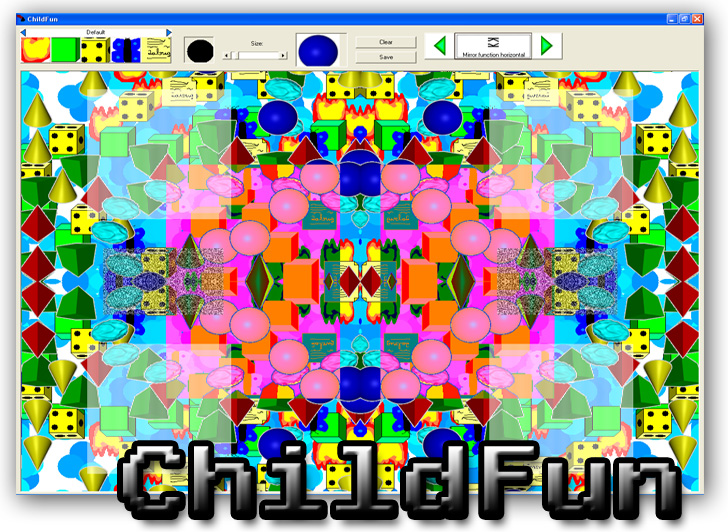



## ChildFun v3\.2 UPGRADED\!

### Description

It's name was ChildFun because i maked it for my little brother, but adults can work in it too. Draw interesting images with brush and image sprayer function. Fixed bug in mnuPopupRandom and changed .jpg to .bmp saving format. Vote please! More info in project. NOW UPGRADED FROM VERSION v1.0 to v3.2!!!! See txt file for more information about version history.

- Now image sprayer has masks.

- Support for image sprayer set. You can draw with three different sets!

- Support for plugins. Very interesting plugins with minimum of bugs!

- Commented for a beginner!

:) please vote!

NOTE: I plan to comment whole project. For now very little bit is commented.
 
### More Info
 

             |
---                |---
**Submitted On**   |2007-11-03 23:09:48
**By**             |[Davidovic David](https://github.com/Planet-Source-Code/PSCIndex/blob/master/ByAuthor/davidovic-david.md)
**Level**          |Beginner
**User Rating**    |5.0 (15 globes from 3 users)
**Compatibility**  |VB 5\.0, VB 6\.0
**Category**       |[Complete Applications](https://github.com/Planet-Source-Code/PSCIndex/blob/master/ByCategory/complete-applications__1-27.md)
**World**          |[Visual Basic](https://github.com/Planet-Source-Code/PSCIndex/blob/master/ByWorld/visual-basic.md)
**Archive File**   |[ChildFun\_v2089571142007\.zip](https://github.com/Planet-Source-Code/davidovic-david-childfun-v3-2-upgraded__1-68887/archive/master.zip)

